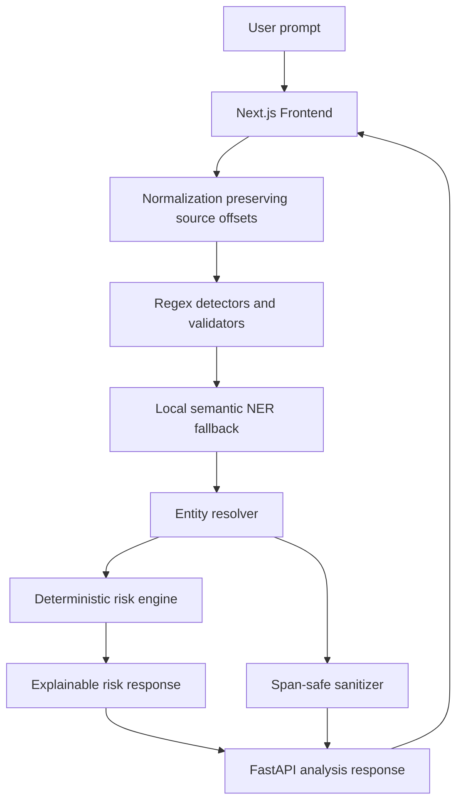

# PromptGuard-KVKK architecture

Phase 3 remains a modular monolith. The browser calls the versioned FastAPI API, which processes prompts in memory through detection, risk, and sanitization stages. SQLite remains metadata-only and stores neither raw prompts nor detected entity text.

## Privacy by design

Raw prompts and detected values are processed transiently. The database model has only an ID, timestamp, and status; the Phase 3 endpoint does not insert a row. There are no prompt/entity columns, no prompt logging, and generic exception responses. Future audit logging must avoid collecting sensitive content unless strictly necessary and explicitly authorized.

## Current API

- `GET /api/v1/health` verifies backend reachability.
- `POST /api/v1/analyze` validates a bounded, non-empty prompt and returns detected entities with original offsets, confidence, source, category, base weight, contribution, reason, a bounded risk summary, risk factors, and a sanitized prompt. It does not save the prompt or entities.

## Risk implementation notes

Entity weights and categories are centralized in `backend/app/services/risk/weights.py`. `risk_engine.py` applies confidence-weighted base contributions, direct-identifier sensitivity, category-combination bonuses, diversity, and bounded repetition. `policy.py` maps LOW/MEDIUM/HIGH/CRITICAL to ALLOW/WARN/MASK/BLOCK. The score is clamped to 0-100 and every factor is returned for explainability.

Detection, risk, and sanitization are separate decisions. The centralized sanitization policy applies `MASK` to high-sensitivity identifiers, `PSEUDONYMIZE` to `PERSON`, and `KEEP` to city-level `LOCATION`, `ORGANIZATION`, `DATE`, and `URL`. The sanitizer uses final resolved offsets and builds output left-to-right, preserving whitespace, punctuation, suffixes, line breaks, and all other non-entity characters. Repeated person text receives the same in-memory placeholder for one request; mappings are never persisted or logged. Keeping useful context improves downstream generative-AI utility while risk scoring still includes kept entities.

The risk output is a transparent engineering heuristic. It is not legal advice, a legal classification, or a KVKK compliance certification. `heuristic-local` semantic detection remains deliberately conservative and does not claim reliable detection of every bare organization name.
